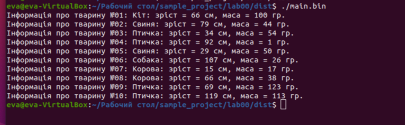
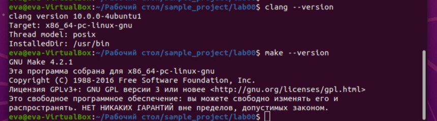

# Лабораторна робота № 1. Робота з структурованими типами даних

## 1 Вимоги

### 1.1 Розробник

* Коваленко;
* студентка групи КІТ-121д;
* 13.09.2021.

### 1.2 Загальне завдання
Установка середовища для подальшої роботі з предмету
“Програмування”, освоєння командної
строки Linux.

## 2 Хід роботи
### 2.1 Підготовка до роботи з кодом
Інсталювати зазаначені у завданні пакети. Виконати клонування
проекту (репозиторія), який було надіслано викладачем курсу. 

### 2.2 Внесення змін до коду програми

У файл "lib.c" додаємо ще один тип тварин, використовуючи оператор case в умовній конструкції switch/case:
```c
		case BIRD:
        result = "Птичка";
        break;
```
У файл "lib.h" додаємо до масиву константу "BIRD":
```
enum animal_type {
    PIG, 
    COW, 
    DOG, 
    CAT,
    BIRD,
    ANIMAL_TYPE_COUNT 
};
```
Таким чином при генерації нової тварини є можливість створення тварини з типом "BIRD".

### 2.2 Внесення змін до Makefile
Додоємо ціль all у текстовому редакторі до файлу Makefile, яка буде виконувати цілі "clean prep compile check":

```
all: clean prep compile check

```
Для того, щоб файл test.bin не створювався видаляємо з файлу Makefile рядки, відповідаючі за його створення:

```
test.bin: test/test.c
	$(CC) $(C_OPTS) $< -o ./dist/$@
  
```
Наявність файлу test.bin перевіряємо за допомогою утиліти tree:

```
dist
│   └── main.bin
├── Doxyfile
├── Makefile
├── README.md
├── src
│   ├── lib.c
│   ├── lib.c.dump
│   ├── lib.h
│   ├── main.c
│   └── main.c.dump
└── test
    ├── test.c
    └── test.c.dump
    
```
### 2.3 Визначення версії утиліт
Визначити версії утиліт clang та make можна за допомогою команди --version:

### 2.4 Утиліта man 
man (від англ. manual - керівництво) - команда Unix, призначена для форматування і виведення довідкових сторінок.
man - це пейджер довідкових сторінок системи. Кожен параметр "сторінка",
       переданий man, зазвичай є назвою програми, утиліти або функції. За
       кожним з цих параметрів виконується пошук і виведення пов'язаної з ним довідкової
       сторінки.
Для того, щоб скористатися цією утилітою достатньо ввести в терміналі man man, де замість другої man можна ввести будь-яку іншу програму.

### Висновки

Під час виконання цієї роботи було набуто практичні навички роботи з ОС Linux,його терміналом та деякими його утилітами.
