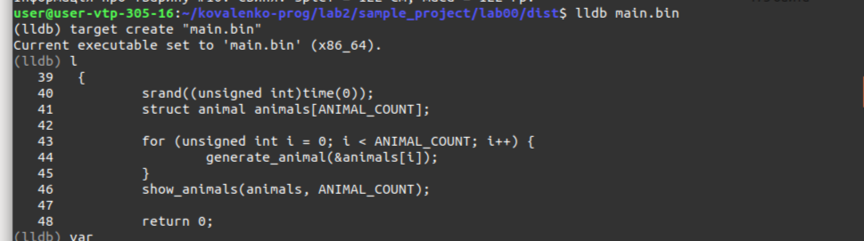
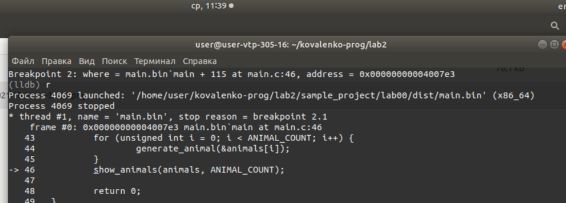

# Лабораторна робота № 2. Освоєння debug процесу
## 1 Вимоги

### 1.1 Розробник

* Коваленко Єва;
* студентка групи КІТ-121д;
* 13.09.2021.

### 1.2 Загальне завдання
Установка середовища для подальшої роботі з предмету
“Програмування”, освоєння основ debug процессу.

## 2 Хід роботи
### 2.1 Підготовка до роботи 
Зареєструватися на github, створити репозиторій для лабораторних робіт, склонувати створенний репозиторій на комп'ютер за допомогою команди git clone. Склонувати до цього репозиторія попередню роботу.

### 2.2 Фіксування змін
Додати до проекту новий тип "Людина". Установити відлагодник lldb

```
sudo apt install lldb
```
Відкрити у відлагоднику виконуючий файл програми:
 

Зробити точку зупинку на будь-якій строці за допомогою команди breakpoint 11, де замість 11 вставити потрібну строку, та подивитися на результат та значення змінних за допомогою команди r:


Далі нам потрібно загрузити зміни з комп'ютера до репозитория.
Для цього спочатку визначаємо наші зміни за допомогою команди git status:

Потім додаємо ці зміни до комміта за допомогою команди "git add ." та перевіряємо наявність змін для комміта — вони повинний відобразитися зеленим:

Коментуємо наши зміни для відображення на репозиторії:

```
git commit -m "Додан новий тип "Людина"" 
```
Після цієї строки повинно йти повідомлення від терміналу о додаванні коментару, а також перелік змін для цього коментара.
Останнім шагом загружаємо наші откоментовані зміни на видалений репозиторій за допомогою команди git push, де після цього нам потрібно буде ввести ім'я юзера та пароль або тимчасовий токен:

